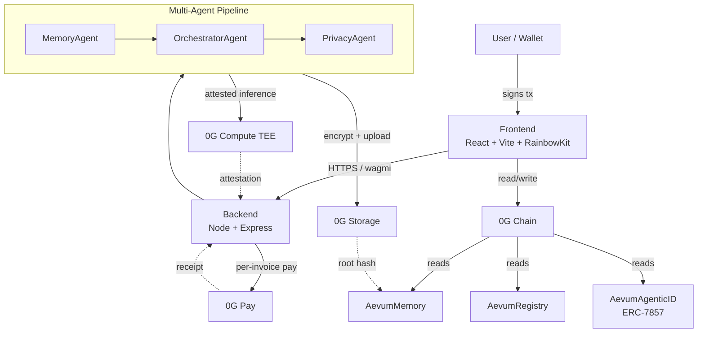

# Aevum

> **The memory layer for the 0G agent ecosystem.**
> Persistent, encrypted, verifiable AI agent memory on decentralized infrastructure.

[](https://0g.ai)
[](https://0g.ai)
[](./LICENSE)
[](./contracts)
[](./frontend)

Aevum gives every AI agent on 0G persistent, encrypted, verifiable memory — backed by 0G Storage, settled on 0G Chain, attested by 0G Compute TEEs, monetized via 0G Pay, and owned as **ERC-7857 Agentic ID NFTs** that travel with the agent.

---

## Why Aevum

Today's AI agents have **amnesia**. Every session, every API call, every new chat thread starts from zero. They forget your preferences, your projects, your past conversations. This isn't a UX bug — it's an **infrastructure gap**. Agent memory at scale is petabytes of conversation history that no centralized provider can credibly own, no single party can verify, and no user can control.

Aevum fills that gap. We turn agent memory into **verifiable, ownable infrastructure**: encrypted blobs on 0G Storage, ownership receipts on 0G Chain, TEE-attested inference from 0G Compute, agent identity as transferable NFTs (ERC-7857), and paid inference via 0G Pay — all stitched together by a multi-agent pipeline (Memory → Orchestrator → Privacy) that runs end-to-end on 0G's modular stack.

---

## What Aevum Does

- 🧠 **Persistent agent memory** — encrypted with AES-256-GCM, stored on 0G Storage, retrievable across sessions, devices, and clients
- 🪪 **On-chain agent identity** — agents registered on 0G Chain via `AevumRegistry`, ownership provable from any wallet
- ✅ **Verifiable inference** — every AI response ships with TEE-attested proof from 0G Compute, fallback to OpenAI when TEE unavailable
- 🔐 **Privacy by default** — `PrivacyAgent` runs *last* in the pipeline, redacts PII, scrubs secrets, enforces per-agent ACLs
- 🤝 **Multi-agent orchestration** — `MemoryAgent` → `OrchestratorAgent` → `PrivacyAgent` pipeline, composable across agent frameworks
- 🎫 **ERC-7857 Agentic IDs** — agents are transferable as NFTs with encrypted metadata URI; memory travels with the agent

---

## 0G Component Deep-Dive

Aevum touches **all five** 0G components. Each one plays a specific, load-bearing role.

| 0G Component | Role in Aevum | Code Reference |
|---|---|---|
| **0G Storage** | Encrypted memory blobs (AES-256-GCM ciphertext) + agent metadata JSON. Every memory is content-addressed, replicated across the 0G Storage network, retrievable by root hash stored on-chain. | `backend/src/services/storage.ts`, `backend/src/agents/MemoryAgent.ts` |
| **0G Chain** | Source of truth for: (1) **agent ownership** (`AevumRegistry`), (2) **memory pointers** (root hash + URI on `AevumMemory`), (3) **access control lists**, (4) **Agentic ID NFT ownership** (ERC-7857). All writes are user-signed transactions. | `contracts/src/AevumRegistry.sol`, `contracts/src/AevumMemory.sol`, `contracts/src/AevumAgenticID.sol` |
| **0G Compute** | TEE-attested inference for every agent response. Privacy-sensitive prompts (PII redaction, secret detection) are routed to TEE; general chat is routed to TEE first, OpenAI fallback. The TEE proof (attestation quote, code hash, model hash) is returned alongside the response. | `backend/src/services/compute.ts`, `backend/src/agents/PrivacyAgent.ts` |
| **0G Pay** | Per-inference micropayments in 0G-native tokens. The frontend opens a 0G Pay session on connect; backend charges per request, signs a usage receipt, settles on-chain. Removes the need for centralized billing. | `backend/src/services/pay.ts`, `frontend/src/hooks/usePay.ts` |
| **ERC-7857 Agentic ID** | The on-chain "passport" for each agent. Holds the encrypted metadata URI (pointing to 0G Storage), the public owner address, and the inference TEE pubkey. Transferable as an NFT, so agent memory and identity move together. | `contracts/src/AevumAgenticID.sol` (implements ERC-7857) |

---

## Architecture



**Data flow in one sentence:** user prompt → orchestrator routes → memory agent recalls relevant past context from 0G Storage → compute (TEE) generates response with attestation → privacy agent redacts → response + memory pointer + TEE proof returned to user → pointer and usage receipt written to 0G Chain.

---

## Quick Start

```bash
# 1. Clone
git clone https://github.com/your-org/aevum.git
cd aevum

# 2. Install
npm install                       # workspaces: backend + frontend
cd contracts && forge install && cd ..

# 3. Configure
cp .env.example .env              # fill in PRIVATE_KEY, RPC, 0G endpoints
cp frontend/.env.example frontend/.env
cp backend/.env.example backend/.env

# 4. Run locally
npm run dev                       # frontend at :5173, backend at :3000

# 5. Test
cd contracts && forge test && cd ..
npm test                          # unit tests (backend + frontend)
npm run test:e2e                  # end-to-end pipeline test

# 6. Deploy (Galileo testnet)
cd contracts
forge script script/Deploy.s.sol --rpc-url $OG_GALILEO_RPC --broadcast
```

Full deployment guide: [`docs/SETUP.md`](./docs/SETUP.md)

---

## 5-Wave Roadmap

| Wave | Theme | Milestone | Success Criteria |
|---|---|---|---|
| **W1** (Jun 26) | **Project Scoping & 0G Integration Plan** | This submission: architecture, contract scaffolds, pipeline spec, team. Repo + docs live, contracts compile. | Docs complete, 3 contracts scaffolded, Mermaid diagrams render, deployment plan reviewed |
| **W2** (Jul 17) | **Core Smart Contracts** | `AevumRegistry`, `AevumMemory`, `AevumAgenticID` (ERC-7857) deployed to Galileo. Foundry test suite ≥ 90% coverage. | All contracts deployed, all unit tests pass, OpenZeppelin audit checklist complete |
| **W3** (Aug 7) | **Memory Pipeline + 0G Storage** | `MemoryAgent` + `OrchestratorAgent` running. Encrypted write/read to 0G Storage. Frontend v0.1 (connect wallet, view agents, basic chat). | 100 encrypted memories round-tripped, frontend deployed to Vercel preview, Galileo demo recording |
| **W4** (Aug 28) | **Verifiable Inference + 0G Pay** | `PrivacyAgent` + 0G Compute TEE integration. 0G Pay session. Frontend v1.0 with TEE proof badge, usage receipts, agent transfer UI. | 50 real TEE-attested inferences, 0G Pay session works, public frontend on Vercel |
| **W5** (Sep 18) | **Mainnet + Demo Day** | Contracts on 0G mainnet, public launch, Demo Day pitch at Token2049, full ERC-7857 transfer flow live. | Mainnet deployment, 1k+ agents registered, public demo, Token2049 slot |

---

## Repository Layout

```
aevum/
├── README.md                  ← you are here
├── CHANGELOG.md
├── LICENSE
├── contracts/                 ← Foundry (AevumRegistry, AevumMemory, AevumAgenticID)
├── backend/                   ← Node + Express + multi-agent pipeline
├── frontend/                  ← React + Vite + RainbowKit + wagmi
├── docs/                      ← architecture, setup, demo, pitch, posts
└── .github/workflows/         ← CI
```

---

## Team

| | Role | Background |
|---|---|---|
| **_[Name 1]_** | Lead / Smart Contracts | Solidity, Foundry, ERC-721/1155/7857 |
| **_[Name 2]_** | Backend / Agents | TypeScript, multi-agent systems, 0G Storage SDK |
| **_[Name 3]_** | Frontend / UX | React, wagmi, RainbowKit, design systems |
| **_[Name 4]_** | 0G Integration | 0G Storage, 0G Compute, 0G Pay, TEE |
| **_[Name 5]_** | Ops / GTM | Hackathon ops, demo production, X/community |

_(Replace placeholders with real names, avatars, and links.)_

---

## Links

- **Docs**: [`docs/ARCHITECTURE.md`](./docs/ARCHITECTURE.md) · [`docs/SETUP.md`](./docs/SETUP.md) · [`docs/WAVE1_SUBMISSION.md`](./docs/WAVE1_SUBMISSION.md)
- **Contracts**: [`contracts/`](./contracts/) (Foundry)
- **Demo script**: [`docs/DEMO_SCRIPT.md`](./docs/DEMO_SCRIPT.md)
- **Pitch deck**: [`docs/PITCH_DECK.md`](./docs/PITCH_DECK.md)
- **X posts**: [`docs/X_POSTS.md`](./docs/X_POSTS.md)
- **Troubleshooting**: [`docs/TROUBLESHOOTING.md`](./docs/TROUBLESHOOTING.md)
- **Contributing**: [`docs/CONTRIBUTING.md`](./docs/CONTRIBUTING.md)
- **0G**: https://0g.ai
- **Buildathon**: 0G Bridge (AKINDO)

---

## License

[MIT](./LICENSE) — see `LICENSE` for the full text.
