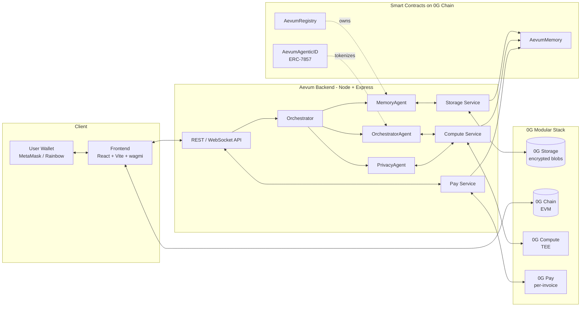
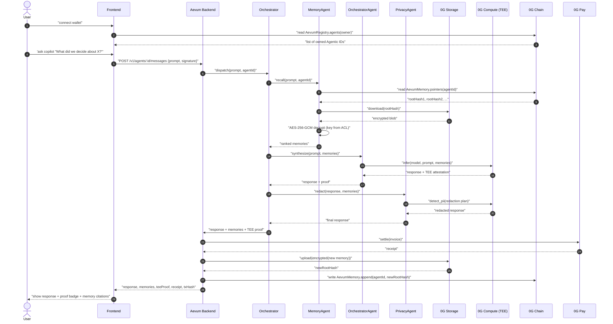
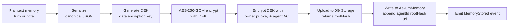
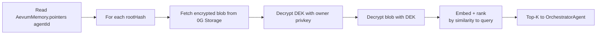
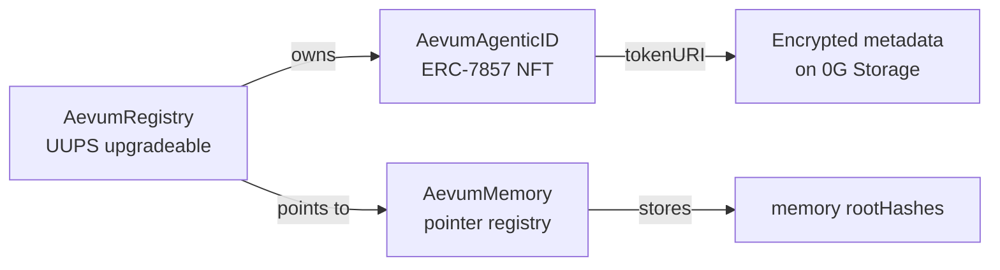
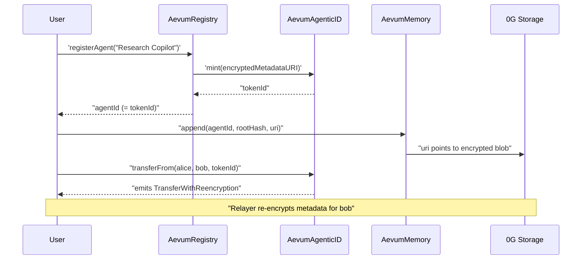

# Aevum Architecture

> Technical deep-dive into how Aevum assembles the five 0G components into a coherent, verifiable, privacy-preserving memory layer for AI agents.

**Audience:** engineers integrating with Aevum, judges evaluating the 0G fit, contributors.
**Status:** Wave 1 scoping — describes the *target* architecture. Code references are to the planned source tree (`backend/src/...`, `contracts/src/...`).

---

## 1. High-Level Architecture



### What lives where

| Layer | What | Why |
|---|---|---|
| **Frontend** (`frontend/`) | Wallet connect, agent dashboard, chat UI, TEE proof badge, paymeter | Direct user surface; reads chain via wagmi, calls backend over HTTPS |
| **Backend** (`backend/`) | Multi-agent pipeline, encryption, TEE orchestration, pay settlement | Off-chain compute; never holds plaintext at rest |
| **0G Storage** | Encrypted memory blobs, agent metadata JSON | Petabyte-scale, content-addressed, decentralized |
| **0G Chain** | Ownership, pointers, ACLs, Agentic ID NFTs | Verifiable, composable, trustless settlement |
| **0G Compute** | TEE-attested LLM inference + privacy transforms | Removes the "did the model actually run?" problem |
| **0G Pay** | Per-invoice micropayments | Aligns cost with usage, removes centralized billing |

---

## 2. End-to-End Sequence — User Query



### Step notes

1. **Wallet connect** is mandatory — every agent call is signed.
2. **Memory recall** is a chain-read + storage-download + local-decrypt. The decryption key is derived per-(owner, agent) and never crosses 0G Storage or 0G Chain in cleartext.
3. **TEE inference** is the default; if 0G Compute is unavailable, the compute service signs the fallback response and marks it `unattested` so the UI shows a warning badge.
4. **Privacy agent runs last** so it sees the *final* synthesized response, not just raw model output.
5. **Settlement** happens before the response is returned. The receipt is included in the API response so the frontend can show it.

---

## 3. Data Flow — Memory Lifecycle

### 3.1 Write path



Key choices:
- **Per-memory DEK** so a single key leak doesn't compromise all memories.
- **Canonical JSON** (sorted keys, no whitespace) so dedup hashing is stable.
- **Storage URI** stored on-chain alongside the root hash, so the contract can recover even if the 0G Storage RPC changes.

### 3.2 Read path



### 3.3 What is on-chain vs off-chain

| Data | Location | Reason |
|---|---|---|
| Agent ownership | **0G Chain** (`AevumRegistry`) | Verifiable, single source of truth |
| Agent metadata URI (encrypted) | **0G Chain** (`AevumAgenticID`) | Travels with the NFT |
| Memory root hash | **0G Chain** (`AevumMemory`) | Pointer must be trustless |
| Memory ciphertext | **0G Storage** | Petabyte-scale, cheap |
| Memory plaintext | **Never persisted** | Recomputed under owner key on read |
| TEE attestation | **0G Chain** (anchored hash) | So proof is verifiable without the backend |
| Pay receipts | **0G Chain** | Composable with other 0G apps |

---

## 4. Security Model

### 4.1 Encryption

- **Algorithm:** AES-256-GCM (authenticated encryption; integrity + confidentiality in one primitive).
- **Key hierarchy:**
  - **Owner key** (secp256k1, derived from wallet signature) → wraps per-memory DEKs.
  - **Agent ACL key** → wraps per-memory DEKs for delegated agents.
  - **DEK** (random 256-bit) → wraps the actual memory blob.
- **IV/nonce:** 12 bytes random per encryption. Stored alongside ciphertext.
- **AAD (additional authenticated data):** `agentId || owner || createdAt` — prevents ciphertext relocation across agents.

### 4.2 Access control

Three roles, enforced on-chain and re-checked in the backend:

| Role | Can do | Source |
|---|---|---|
| `OWNER` | Full memory read/write, transfer agent, rotate keys | EOA recovered from `msg.sender` |
| `DELEGATE` | Read+write specific memory namespaces | `AevumMemory.allow(agentId, delegate, scope)` |
| `PUBLIC` | Read agent metadata only | `tokenURI` of `AevumAgenticID` (encrypted blob, decrypt required) |

### 4.3 TEE verification

Every inference response includes:

```ts
type TeeProof = {
  provider: "0g-compute";
  modelHash: `0x${string}`;
  codeHash: `0x${string}`;
  inputDigest: `0x${string}`;
  outputDigest: `0x${string}`;
  attestation: `0x${string}`;   // quote bytes
  issuedAt: number;             // unix
  nonce: `0x${string}`;
};
```

The frontend:
1. Verifies the attestation against 0G's published TEE root keys.
2. Recomputes `inputDigest` and `outputDigest` and checks match.
3. Shows a ✅ badge. If any check fails → ❌ "Inference not verified" badge.

If 0G Compute is unreachable, the backend falls back to OpenAI **and explicitly sets `provider: "openai-fallback"`** so the badge is honest.

### 4.4 Threat model — what we cover, what we don't

✅ **Covered:** stolen device (data at rest encrypted), malicious backend (TEE attestations verifiable on-chain), unauthorized memory reads (ACL on-chain), agent identity spoofing (Agentic ID NFT + ownership), replay attacks (per-request nonce), MITM (TLS + signed requests).

❌ **Not covered:** owner key compromise (your problem), malicious model output (we attest *that* the model ran, not that the output is correct), 0G Storage shard going permanently offline (data loss is possible if no replication tier chosen).

---

## 5. Smart Contract Architecture

### 5.1 Contract map



### 5.2 `AevumRegistry.sol`

**Purpose:** canonical directory of all agents, with ownership.

```solidity
// contracts/src/AevumRegistry.sol
function registerAgent(string calldata name, address agenticId)
    external returns (uint256 agentId);

function transferAgent(uint256 agentId, address to) external;
function agentsOf(address owner) external view returns (uint256[] memory);
function resolveAgent(uint256 agentId) external view returns (address owner, address agenticId);
```

Key choices:
- `registerAgent` mints a new `AevumAgenticID` and links it to the caller as `OWNER`.
- Ownership transfer is the standard `transferAgent` and the underlying NFT transfer must match.
- UUPS proxy for upgradeability (W2+).

### 5.3 `AevumMemory.sol`

**Purpose:** ordered list of memory pointers per agent + per-agent ACL.

```solidity
// contracts/src/AevumMemory.sol
function append(uint256 agentId, bytes32 rootHash, string calldata uri) external;
function pointers(uint256 agentId) external view returns (Pointer[] memory);
function allow(uint256 agentId, address delegate, bytes32 scope) external;
function revoke(uint256 agentId, address delegate) external;
```

Key choices:
- ACL is per-agent, scope is a `bytes32` (we use `keccak256("read")`, `keccak256("write")`, etc.).
- `append` is permissionless for the agent's owner or a delegated writer.
- The contract stores only **pointers**. Plaintext never touches the chain.

### 5.4 `AevumAgenticID.sol` (ERC-7857)

**Purpose:** the NFT that *is* the agent. Owning the token = owning the agent.

```solidity
// contracts/src/AevumAgenticID.sol
// Implements ERC-7857 (in-flight standard from 0G)
function mint(address to, string calldata encryptedMetadataURI) external returns (uint256);
function setInferencePubKey(uint256 tokenId, bytes calldak pubKey) external;
function transferFrom(address from, address to, uint256 tokenId) external override;
```

ERC-7857 specifics we honor:
- `tokenURI` returns an **encrypted** metadata URI on 0G Storage (decrypt with the owner's key).
- Inference pubkey rotation is restricted to the token owner.
- The standard transfer hook re-encrypts metadata for the new owner (off-chain by relayer, on-chain settlement via `transferWithReencryption` event we emit).

### 5.5 Interaction pattern



---

## 6. Agent Pipeline

The pipeline is intentionally **stateless between calls** — every call rehydrates from chain + storage.

```
        ┌─────────────────────────────────────────────────────┐
        │  Orchestrator  (per-request dispatch)               │
        └─────────────────────────────────────────────────────┘
                  │
   ┌──────────────┼──────────────┐
   ▼              ▼              ▼
MemoryAgent  OrchestratorAgent  PrivacyAgent
(recall)     (synthesize)       (redact)
   │              │              │
   ▼              ▼              ▼
0G Storage    0G Compute TEE   0G Compute TEE
   │              │              │
   └──────────────┴──────────────┘
                  ▼
            Final Response
```

### 6.1 `MemoryAgent.ts`  (`backend/src/agents/MemoryAgent.ts`)

- Input: `prompt`, `agentId`, `owner`
- Steps:
  1. Read `pointers(agentId)` from `AevumMemory`.
  2. Download top-K by recency from 0G Storage.
  3. Decrypt with the owner's session key.
  4. Embed prompt and memories (model: small embedding served via 0G Compute TEE).
  5. Return top-N most relevant.
- Output: `{ memories: Memory[], scores: number[] }`

### 6.2 `OrchestratorAgent.ts`  (`backend/src/agents/OrchestratorAgent.ts`)

- Input: `prompt`, `memories`, `agentConfig`
- Steps:
  1. Build the prompt template (system + memories + user).
  2. Call 0G Compute TEE with the model specified in the agent's `AgenticID.metadata`.
  3. Capture the attestation.
- Output: `{ response, teeProof }`

### 6.3 `PrivacyAgent.ts`  (`backend/src/agents/PrivacyAgent.ts`)

- Input: `response`, `memories`, `userPrompt`
- Steps:
  1. Run PII detector (TEE) over the response.
  2. Replace detected spans with `[REDACTED:<type>]`.
  3. Run secret scanner (regex + entropy) on the response and memories that will be persisted.
  4. Mark anything that needs scrubbing.
  5. **Last** in the pipeline so it sees the final, formatted response.
- Output: `{ redactedResponse, redactionLog }`

### 6.4 Why this order?

- Memory first → keeps prompts small and relevant.
- Orchestrator second → uses context.
- Privacy last → sees final output, not a draft that could leak in logs.

---

## 7. Storage Strategy

### On-chain (0G Chain)
- `AevumRegistry`: agent name + owner + linked Agentic ID
- `AevumMemory`: ordered array of `(rootHash, uri, createdAt)` per agentId
- `AevumAgenticID`: NFT ownership + `tokenURI` + inference pubkey

### Off-chain (0G Storage)
- Encrypted memory blobs
- Encrypted agent metadata JSON
- TEE attestation raw quotes (anchored hash on-chain for verifiability)
- Pay receipt signed payloads (anchored hash on-chain)

### Replication tier
- Default: standard 0G Storage replication (cost-efficient).
- W4+: optional **archival** tier for users who want stronger durability guarantees.

---

## 8. Compute Strategy

| Route | When | Attestation |
|---|---|---|
| 0G Compute TEE (default) | 0G Compute has capacity | Full TEE quote + model/code/input/output digests |
| OpenAI fallback | 0G Compute unavailable or rate-limited | `provider: "openai-fallback"`, no attestation, UI shows ⚠️ badge |
| Local model (W5+) | Edge/offline mode | `provider: "local"`, signed by device key |

The compute service (`backend/src/services/compute.ts`) is the **single chokepoint** for all inference. Every response, regardless of route, is normalized into the same `TeeProof`-shaped envelope so the UI can render one consistent badge.

---

## 9. Scalability Considerations

- **Storage:** 0G Storage is content-addressed and replicated. Aevum's job is to keep the per-memory payload small (compress canonical JSON, gzip if >4 KB).
- **Chain:** we minimize on-chain writes. A single `append()` per stored memory. No on-chain reads inside the hot path of inference (all reads cached in backend for ~10s).
- **Compute:** TEE calls are the latency bottleneck (~300-800ms). We mitigate with: (a) prompt templating cache, (b) memory top-K, (c) streaming responses (W4+).
- **Pay:** per-invoice is fine at our scale (1k+ inferences/day). We aggregate receipts daily on-chain to amortize gas.
- **Privacy agent:** runs only on responses that will be shown to a user or persisted. Skip for internal pipeline steps.

---

## 10. Open Questions (W1)

- [ ] Exact ERC-7857 final spec — confirming details with 0G team
- [ ] 0G Compute TEE attestation verification flow — pending doc from 0G
- [ ] 0G Pay session lifecycle — assuming "open session, settle on close" model
- [ ] Archival tier SLA — TBD with 0G
